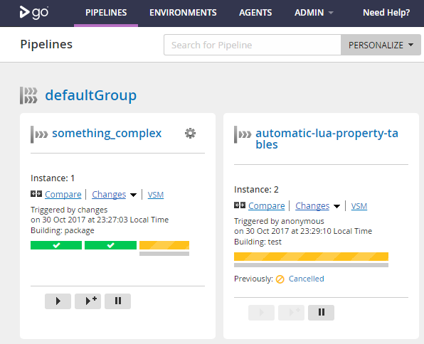

# GoCD Infrastructure as Code

[](https://travis-ci.org/d-led/gocd_docker_compose_example)

a simple [GoCD](https://www.gocd.io/) demo environment that completely provisions itself and adds a [pipeline](https://github.com/d-led/cctray-rpi-unicorn-hat-monitor) (as a [YAML](https://github.com/tomzo/gocd-yaml-config-plugin) config) via the [REST API](https://api.gocd.io/).

[&rarr; Blog: Self-contained GoCD Environment Using Docker-Compose](https://ledentsov.de/2017/03/04/self-contained-gocd-docker-compose/)

## the versions

- [original](original) - a server and an agent container as they are out of the box
- [static_config](static_config) - 2 different agents, server provisioned via a static config file mapped into the container
- [provisioned_externally](provisioned_externally) - 2 different agents, server provisioned externally via the API

## summary of the provisioned version

the startup sequence:

- the GoCD server starts
- two different agents start
- agents wait to connect to the server
- the provisioner waits some, and adds the pipelines to the config
- the server picks up the config and starts the builds

## up and running

in [static_config](static_config), run:

```
docker-compose up -d
```

## access the instance

- http://[go-server-ip]:8153



## shutdown

```
docker-compose stop
```

or destroy via:

```
docker-compose down --remove-orphans
```
